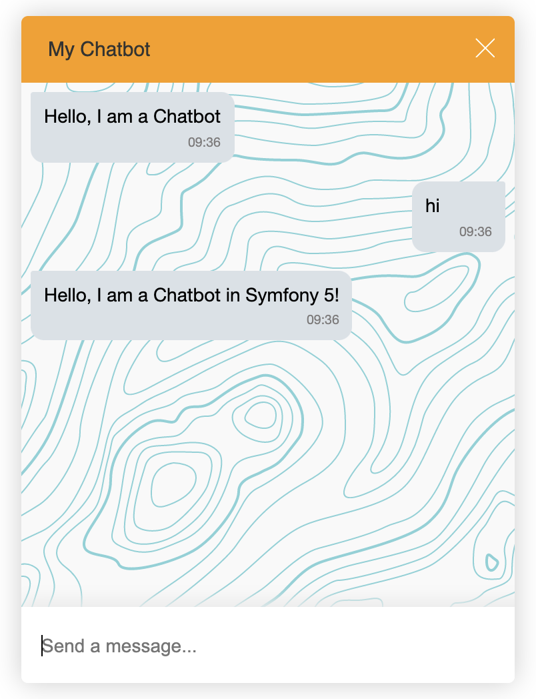

<div align="center">
  
  <h3>A symfony 5 Chatbot Demo using ChatGPT-3, Youtube, Giphy, WeatherStack apis...🇫🇷 🇺🇸</h3>
  <p>This is a symfony 5 Chatbot Demo by using [Botman](https://botman.io). It can be used as Chatbot symfony 5 starter.</p>

  <p>
    <a href="#">
      
    </a>
    <a href="#">
      
    </a>
  </p>
</div>

---


## Install
```bash
composer install 
```
## Start
```bash
symfony serve -d
# open https://127.0.0.1:8000
```

## ChatBot Commands to test

- "hi" or "salut"  
- "weather in london" or "prévision météo à paris" or "météo à new york"  
- "give me a gif cats" or "envoi un gif mr bean"  
- "my name is john" or "mon nom est alice" or "je m'appelle jessica"  
- "say my name" or "what's my name?" or "dis mon nom" or "quel est mon nom?"  
- "name" or "nom"  
- "survey" or "help" or "stop" or "question"  
- "give me a youtube movie back to the future" or "donne moi une vidéo youtube chats"  
- THEN... ask for everything you want, AI chatGPT will give you answers.  🤖

## API used in POC (you have to get your own api keys as environnement variables)

[API Youtube data V3](https://developers.google.com/youtube/registering_an_application)  
[API Giphy](https://support.giphy.com/hc/en-us/articles/360020283431-Request-A-GIPHY-API-Key)  
[API OpenAI for ChatGPT-3](https://platform.openai.com)  
[API WeatherStack](https://weatherstack.com/)  

Configure your environnement variables that you can find in services.yaml parameters and .env.local   
## licenses

[MIT](./LICENSE) License © 2023  
[@vikbert for CSS and botman starter](https://vikbert.github.io)  
[@jessica kuijer](https://jessicakuijer.com)
