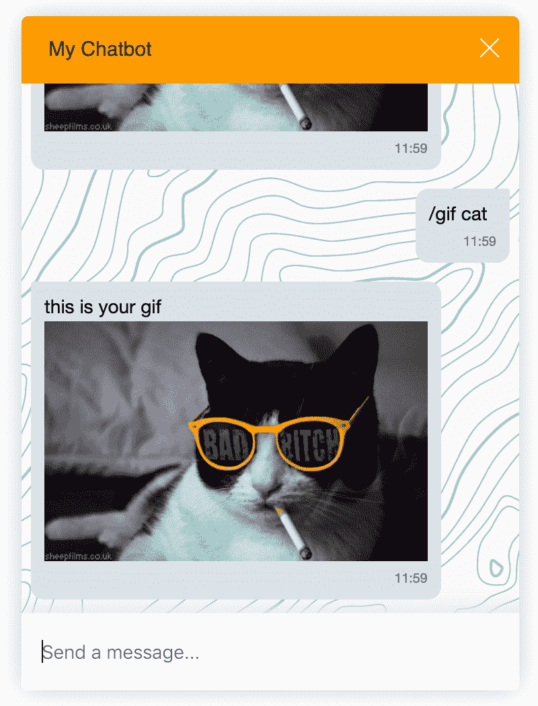
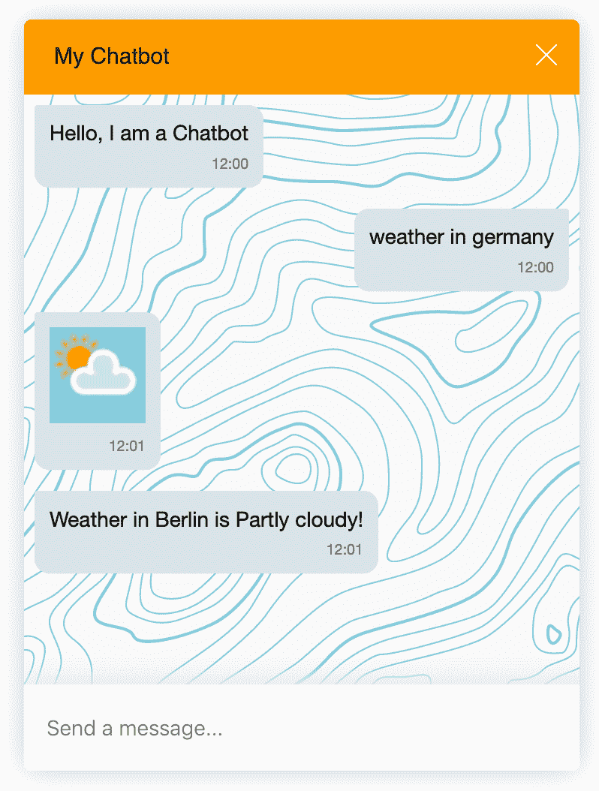

<div align="center">
  
  <h3>A symfony 5 Chatbot Demo</h3>
  <p>This is a symfony 5 Chatbot Demo by using Botman. It can be used as Chatbot symfony 5 starter.</p>

  <p>
    <a href="#">
      
    </a>
    <a href="#">
      
    </a>
  </p>
</div>

---

<br/>
<br/>

## Install
```bash
composer install 
```

## Start
```bash
symfony serve 
# open https://127.0.0.1:8000
```


## API used in POC

<https://developers.giphy.com/dashboard/>


## licence

[MIT](./LICENSE) License © 2021 [@vikbert](https://vikbert.github.io/)
